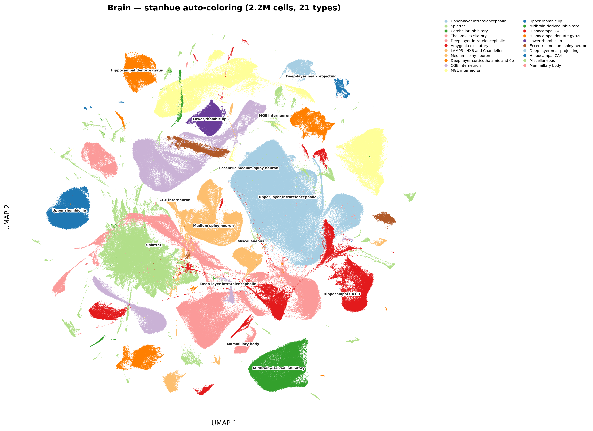
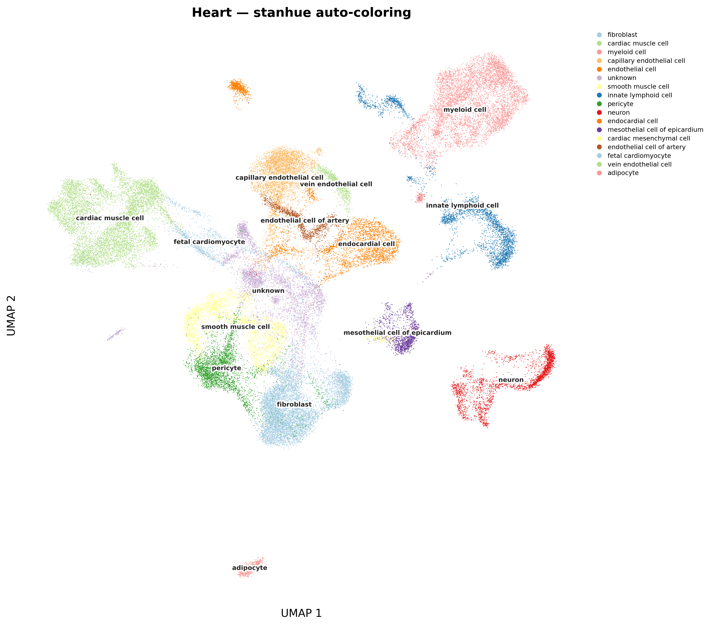
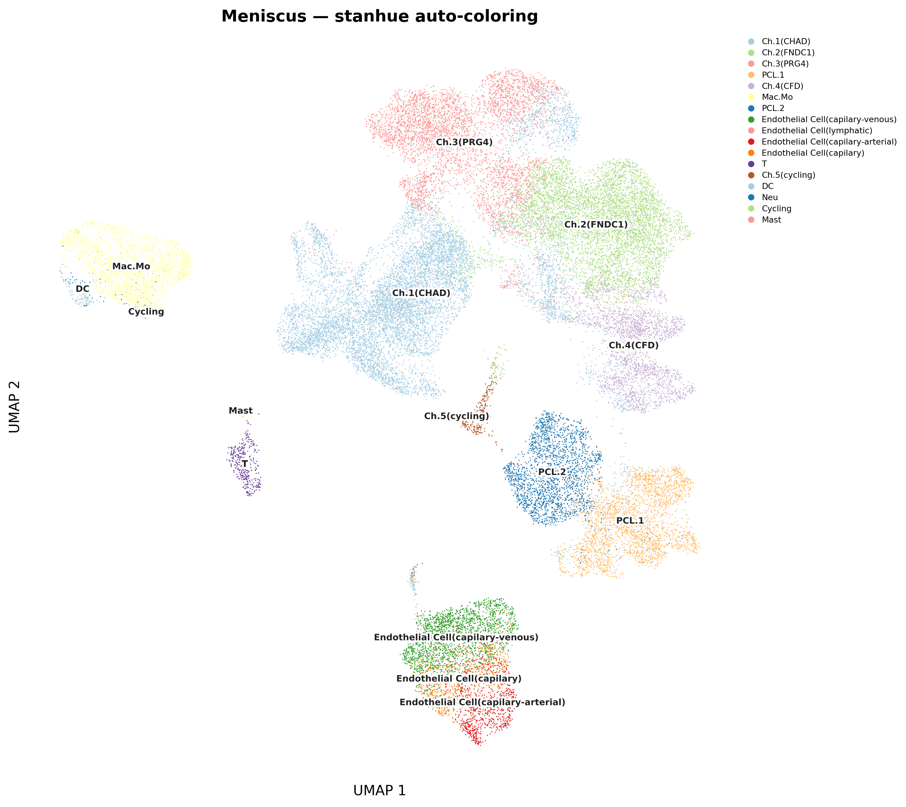

<p align="center">
  
</p>

<h1 align="center">stanhue</h1>

<p align="center">
  Hierarchical auto-coloring for scatter plots with many categorical labels.<br/>
  <em>One function. Two inputs. Publication-quality palettes.</em>
</p>

<p align="center">
  <a href="#python">Python</a> &bull;
  <a href="#r">R</a> &bull;
  <a href="#algorithm">Algorithm</a> &bull;
  <a href="#custom-palette">Custom Palette</a>
</p>

---

## Gallery

All plots below are generated fully automatically — no manual color picking.

<table>
<tr>
<td align="center"><strong>PBMC CITE-seq (57 cell types)</strong></td>
<td align="center"><strong>Brain (21 cell types, 2.5M cells)</strong></td>
</tr>
<tr>
<td></td>
<td></td>
</tr>
<tr>
<td align="center"><strong>Heart (17 cell types)</strong></td>
<td align="center"><strong>Meniscus (15 cell types)</strong></td>
</tr>
<tr>
<td></td>
<td></td>
</tr>
</table>

<details>
<summary><strong>Brain — 382 clusters, 83 auto-groups (click to expand)</strong></summary>

</details>

---

## Why?

When a scatter plot has dozens of categories (e.g., 30+ cell types on a UMAP),
picking colors by hand is tedious and the result is usually ugly. Random
palettes scatter similar hues across unrelated groups; sequential palettes make
neighbors indistinguishable.

**stanhue** solves this by inferring group structure from the 2D layout itself,
then assigning colors so that:

- **Distant groups** get different hue families (blue vs red vs green)
- **Related categories** get adjacent shades within the same family
- **Dominant categories** (most points) anchor each group's representative color

It returns a simple `{label: hex_color}` mapping. You bring your own plotting
code.

## Quick Start

### Python

```python
from stanhue import assign_celltype_colors

colors = assign_celltype_colors(coords, labels)
# {"CD4 Naive": "#a6cee3", "CD8 TEM": "#1f78b4", ...}
```

### R

```r
source("scatter_colormap.R")

colors <- assign_celltype_colors(coords, labels)
# c("CD4 Naive" = "#a6cee3", "CD8 TEM" = "#1f78b4", ...)
```

## Installation

No package manager needed. Just copy the script you need:

| Language | File | Dependencies |
|----------|------|-------------|
| Python | `scatter_colormap.py` | `numpy`, `scipy` |
| R | `scatter_colormap.R` | base R only (`stats`) |

```bash
# Python
pip install numpy scipy

# R — no extra packages needed for core functionality
```

## <a name="python"></a>Python API

```python
from stanhue import assign_celltype_colors, get_groups

# Basic usage
color_map = assign_celltype_colors(
    coords,              # (n, 2) array — any 2D embedding
    labels,              # (n,) array — categorical labels
    n_major_groups=None,  # auto-detect, or set manually
    palette=None,         # default: PAIRED_PALETTE (12 colors)
)

# Inspect grouping structure
groups = get_groups(coords, labels)
# {1: ["CD4 Naive", "CD4 TCM", ...], 2: ["CD8 TEM", ...], ...}
```

### Seurat / SCE convenience (R)

```r
# Seurat
colors <- color_seurat(seurat_obj, reduction = "umap", group_by = "cell_type")

# SingleCellExperiment
colors <- color_sce(sce_obj, dimred = "UMAP", col_name = "cell_type")
```

## <a name="algorithm"></a>Algorithm

```
2D coords + labels
      |
      v
1. Centroid per category
      |
      v
2. Ward hierarchical clustering on centroids
   -> auto-determine k via relative gap (k in [3, 15])
      |
      v
3. Order within groups:
   - dominant (most points) -> position 0
   - rest by dendrogram leaf order
      |
      v
4. Assign palette offsets between groups:
   - sorted by total count (descending)
   - step = 2 in Paired palette (0->2->4->6->8->10)
   - >6 groups: fill odd slots (1->3->5->7->9->11)
      |
      v
5. Walk palette from each group's offset (mod palette_len)
      |
      v
Output: { label: "#hex" }
```

The algorithm is **deterministic** — same input always produces the same colors.

## <a name="custom-palette"></a>Custom Palette

The default is ColorBrewer **Paired** (12 colors, 6 light/dark pairs). Pass any
ordered list of hex colors to override:

```python
warm = ["#fee5d9", "#fcbba1", "#fc9272", "#fb6a4a", "#de2d26", "#a50f15"]
colors = assign_celltype_colors(coords, labels, palette=warm)
```

The offset logic adapts automatically.

## Parameters

| Parameter | Default | Description |
|-----------|---------|-------------|
| `coords` | *required* | 2D coordinates, shape `(n, 2)` |
| `labels` | *required* | Categorical labels, length `n` |
| `n_major_groups` | auto | Number of top-level groups. `None` = auto-detect via relative gap |
| `palette` | `PAIRED_PALETTE` | Ordered hex color list of any length |

## Tips

- **Two clusters share a color?** Increase `n_major_groups`.
- **Related categories got unrelated colors?** Decrease `n_major_groups`.
- **30+ categories?** Consider a larger palette (e.g., 20 colors).
- Works with **any** 2D embedding: UMAP, tSNE, PCA, PHATE, etc.
- Not limited to single-cell data — any scatter plot with categorical labels.

## Input Validation

Both implementations validate inputs and raise clear errors:

- `coords` must be `(n, 2)` numeric without NaN/Inf
- `labels` must match `coords` row count
- At least 1 unique label required

## License

MIT
