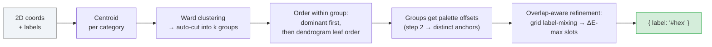

<p align="center">
  
</p>

<h1 align="center">stanhue</h1>

<p align="center">
  <b>Automatic, publication-quality colors for scatter plots with many categorical labels.</b><br/>
  <sub>Infers lineage structure from the 2D layout · keeps related categories in one hue family · pushes overlapping categories apart</sub>
</p>

<p align="center">
  <a href="https://pypi.org/project/stanhue/"></a>
  <a href="https://pypi.org/project/stanhue/"></a>
  
  <a href="https://github.com/chansigit/stanhue/blob/main/LICENSE"></a>
  <a href="https://github.com/chansigit/stanhue/releases"></a>
</p>

<p align="center">
  <a href="#installation">Install</a> ·
  <a href="#quick-start">Quick start</a> ·
  <a href="#overlap-aware-coloring">Overlap-aware</a> ·
  <a href="#how-it-works">How it works</a> ·
  <a href="#api">API</a> ·
  <a href="#faq">FAQ</a>
</p>

<br/>

<table align="center">
  <tr>
    <td align="center"><br/><sub><b>PBMC CITE-seq</b> · 57 cell types</sub></td>
    <td align="center"><br/><sub><b>Brain</b> · 21 cell types · 2.5 M cells</sub></td>
  </tr>
  <tr>
    <td align="center"><br/><sub><b>Heart</b> · 17 cell types</sub></td>
    <td align="center"><br/><sub><b>Meniscus</b> · 15 cell types</sub></td>
  </tr>
</table>

<p align="center"><sub>Every plot above is colored fully automatically — no manual palette picking.</sub></p>

<details>
<summary><b>Stress test: brain, 382 clusters, 83 auto-detected groups</b></summary>
<p align="center"></p>
</details>

<br/>

## Why stanhue?

With 30+ categories on a UMAP, random palettes scatter similar hues across unrelated groups and sequential palettes make neighbors indistinguishable. Picking colors by hand is tedious and rarely looks good.

**stanhue** reads the structure out of the 2D layout itself and assigns colors so that:

| | |
|---|---|
| 🎨 **Distant groups → different hue families** | blue vs red vs green |
| 🧬 **Related categories → adjacent shades** | light blue / dark blue for subtypes of one lineage |
| ⭐ **Dominant categories → anchor colors** | the biggest subtype carries the family's representative color |
| 🔀 **Overlapping categories → far-apart colors** | points mixed together in 2D never share a hue *(new in 1.1)* |

One function, two inputs, returns `{label: "#hex"}`. You keep your own plotting code.

## Installation

**Python**

```bash
pip install stanhue
```

**R** — no packages needed beyond base R:

```r
source("https://raw.githubusercontent.com/chansigit/stanhue/main/scatter_colormap.R")
```

**Claude Code plugin**

```
/plugins add chansigit/stanhue
```

Then mention "stanhue" in a conversation to activate the skill.

> Prefer a single file? `stanhue/scatter_colormap.py` is a standalone script that only needs `numpy` and `scipy`.

## Quick start

**Python**

```python
from stanhue import assign_celltype_colors

colors = assign_celltype_colors(adata.obsm["X_umap"], adata.obs["cell_type"])
# {'CD4 Naive': '#a6cee3', 'CD8 TEM': '#1f78b4', ...}

sc.pl.umap(adata, color="cell_type", palette=colors)
```

Straight from a `.h5ad` file, without loading the expression matrix:

```python
from stanhue import color_h5ad

colors = color_h5ad("data.h5ad", label_key="cell_type", embedding_key="X_umap")
```

**R**

```r
colors <- assign_celltype_colors(umap_coords, cell_types)
# Seurat / SingleCellExperiment shortcuts
colors <- color_seurat(seurat_obj, reduction = "umap", group_by = "cell_type")
colors <- color_sce(sce, dimred = "UMAP", col_name = "cell_type")

DimPlot(seurat_obj, group.by = "cell_type", cols = colors)
```

Works with **any 2D embedding** (UMAP, t-SNE, PCA, PHATE, spatial coordinates) and **any categorical scatter plot**, not just single-cell data.

## Overlap-aware coloring

Hierarchical palettes have a blind spot: two categories that sit *on top of each other* end up with the two most similar colors available. Since 1.1, stanhue measures how much each pair of categories mixes in 2D and pushes overlapping pairs toward perceptually distant colors (CIELAB ΔE), while everything else keeps the hierarchical scheme.

<p align="center">
  
</p>

- **Few categories** (≤ palette size): colors are handed out in farthest-point order in CIELAB space, so 2 categories get two strongly contrasting hues instead of light/dark of the same hue.
- **Many categories**: overlapping members swap slots *within* their hue family, or borrow from a neighboring one. Non-overlapping categories keep exactly the colors they had before, so results stay stable.
- Rare populations embedded inside a large one are detected too.
- `overlap_aware=False` reproduces the 1.0 behavior bit for bit.

## How it works


```mermaid
flowchart LR
    A["2D coords<br/>+ labels"] --> B["Centroid<br/>per category"]
    B --> C["Ward clustering<br/>→ auto-cut into k groups"]
    C --> D["Order within group:<br/>dominant first,<br/>then dendrogram leaf order"]
    D --> E["Groups get palette offsets<br/>(step 2 → distinct anchors)"]
    E --> F["Overlap-aware refinement:<br/>grid label-mixing → ΔE-max slots"]
    F --> G["{ label: '#hex' }"]
    style A fill:#f0f4f8,stroke:#999
    style G fill:#d4edda,stroke:#28a745
```

1. **Group.** Category centroids are clustered with Ward linkage. The number of groups is found automatically from the first significant jump in merge distance, or set with `n_major_groups`.
2. **Order.** Inside each group the largest category comes first; the rest follow the dendrogram so neighbors stay adjacent.
3. **Anchor.** Groups are sorted by size and start at palette positions 0, 2, 4, … so every group's dominant color is distinct. Members walk the palette from there.
4. **Separate.** A grid-based estimate of neighbor-label mixing gives an overlap score per pair. Overlapping categories pick, among their available slots, the color that maximizes overlap-weighted CIELAB ΔE.

The whole pipeline is deterministic: same input, same colors.

## API

```python
assign_celltype_colors(coords, labels, n_major_groups=None, palette=None,
                       return_groups=False, overlap_aware=True, overlap_threshold=0.1)
```

| Parameter | Default | Description |
|---|---|---|
| `coords` | required | `(n, 2)` array, any 2D embedding |
| `labels` | required | length-`n` categorical labels |
| `n_major_groups` | auto | number of top-level groups; `None` detects it from the dendrogram |
| `palette` | Paired (12) | ordered list of hex colors, any length |
| `return_groups` | `False` | also return `{group_id: [labels...]}` for grouped legends |
| `overlap_aware` | `True` | separate overlapping categories; `False` = pure hierarchical |
| `overlap_threshold` | `0.1` | mixing score (0–1) below which two categories count as non-overlapping |

Also available: `get_groups(coords, labels)` to inspect the grouping, `color_h5ad(path, ...)` for backed h5ad files, and `plot_umap` / `plot_palette` helpers (matplotlib). The R script mirrors the same functions plus `color_seurat` and `color_sce`.

**Custom palette.** The default is ColorBrewer *Paired* (6 light/dark pairs). Any ordered list works; the offset logic adapts to its length:

```python
warm = ["#fee5d9", "#fcbba1", "#fc9272", "#fb6a4a", "#de2d26", "#a50f15"]
colors = assign_celltype_colors(coords, labels, palette=warm)
```

## FAQ

<details>
<summary><b>Two clearly separate clusters share a color</b></summary>
Increase <code>n_major_groups</code>. With more categories than palette entries some reuse is unavoidable; a longer palette (e.g. 20 colors) helps.
</details>

<details>
<summary><b>Related subtypes got unrelated colors</b></summary>
Decrease <code>n_major_groups</code> so they fall into the same group.
</details>

<details>
<summary><b>Two overlapping categories still look alike</b></summary>
Lower <code>overlap_threshold</code> (e.g. 0.05). If instead colors within a lineage look scrambled, raise it or set <code>overlap_aware=False</code>.
</details>

<details>
<summary><b>Input requirements</b></summary>
<code>coords</code> must be numeric <code>(n, 2)</code> without NaN/Inf, <code>labels</code> must have length <code>n</code>. Both implementations validate inputs and raise clear errors.
</details>

## License

MIT © Sijie Chen
